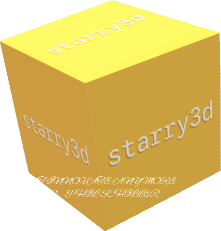

# starry3d

3D game engine for voxel graphics and other fancy crapfrick.

## Features

- C++20
- Cross platform ish
- Blazingly fast
- Optimized for voxel graphics
- UI through [ImGui](https://github.com/ocornut/imgui), you don't have to do anything, it's
  already there
- Built on [libtrippin](https://github.com/hellory4n/libtrippin) the biggest most massive library of all time

## Limitations

- Only does the 3D voxel graphics for now, everything else is nearly non-existent
- Currently only Windows and Linux supported (macOS might work, maybe)
- Experimental software, will definitely change and break

## Documentation

It's in the [docs directory](./docs/README.md). You'll also find the getting started/developing guide there.

## FAQ

### Have you tried \[game engine] you fucking moron

No fuck off.

### Why?

Voxel rendering can be quite the pickle, so I think it's easier and better to just do the whole thing
from scratch. Also why not also the suffering is endless

### Why C++? Can't you be a normal human being and use Rust Go Zig Odin Nim Sip Cliff Swig Beef Jai Swag S'mores?

No fuck off.
