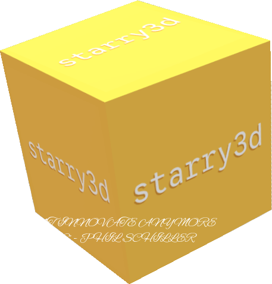

# Starry3D

The voxel graphics toolkit

Engines can be massive. For these we have many directories:
- `starrylib/`: standalone functionality that doesn't depend on the runtime
- `starryrt/`: the big heavy runtime
- `sandbox/`: test project for the engine

Only `lib/` and `runtime/` are needed for a game to run. Conveniently both only depend on the `core:` and `vendor:` packages, so you can just paste them into a new Odin project.

## FAQ

### Have you tried \[game engine] you fucking moron

No fuck off.

### Why?

Voxel rendering can be quite the pickle, so I think it's easier and better to just do the whole thing
from scratch. Also why not also the suffering is endless

### Is this stable enough to use?

No.

### Where's the documentation?

Can't be bothered to write real documentation when the engine changes every picosecond.
